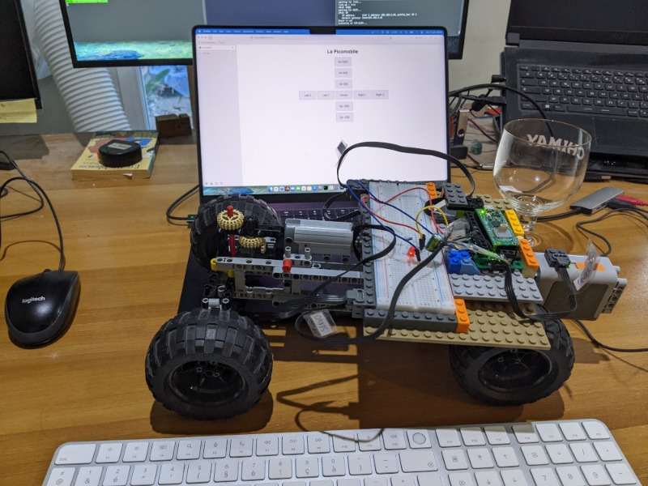

This repository contains the code of the Pico-Mobile as described in [https://dystroy.org/blog/picomobile](https://dystroy.org/blog/picomobile)

For the Cargo.toml file, the Embassy project is assumed to be in ../embassy, on commit 46288501e (unfortunately, I couldn't use the version released on crates.io)

