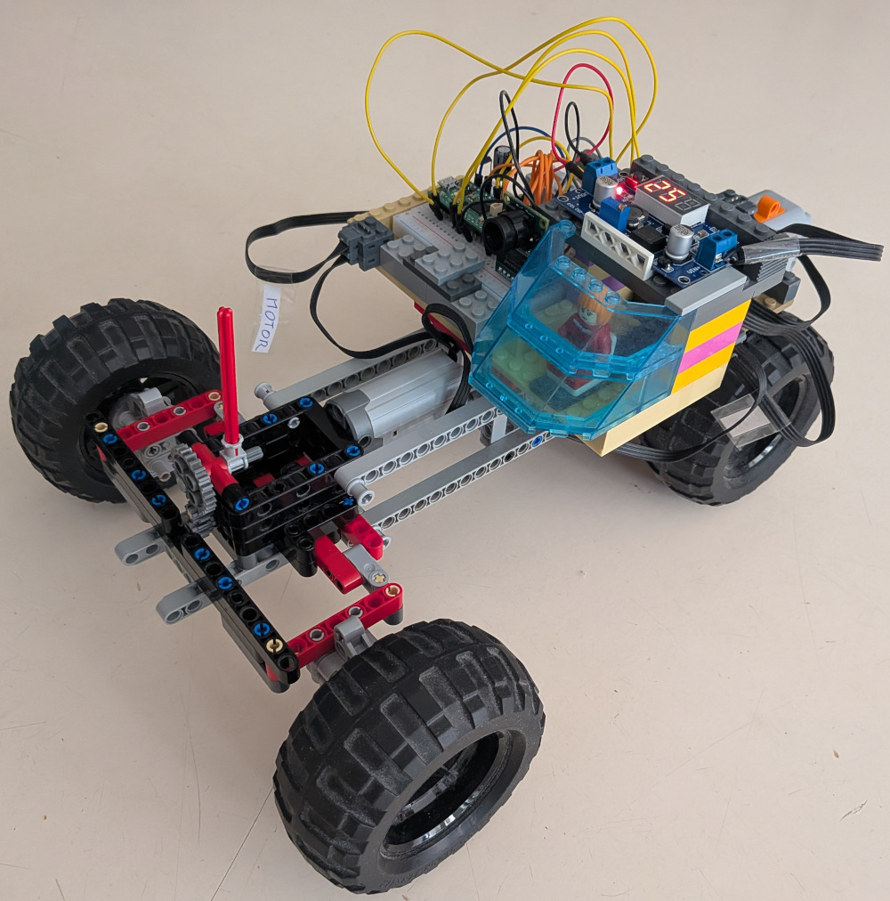
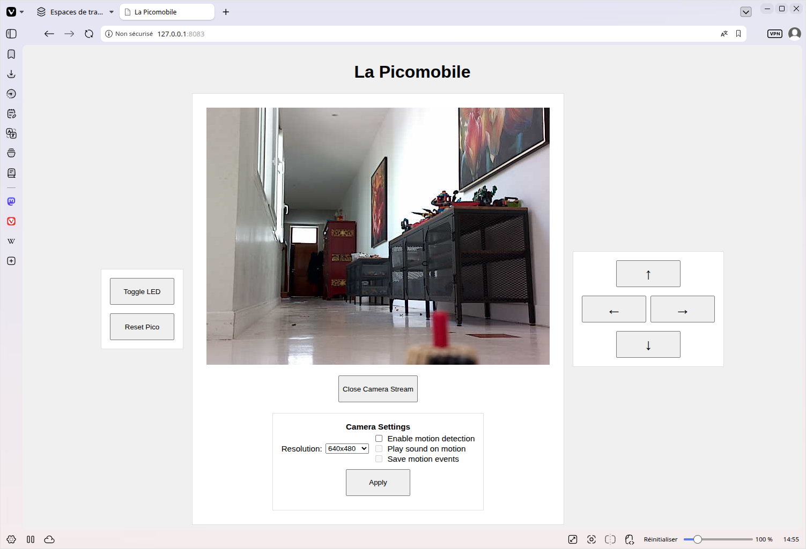
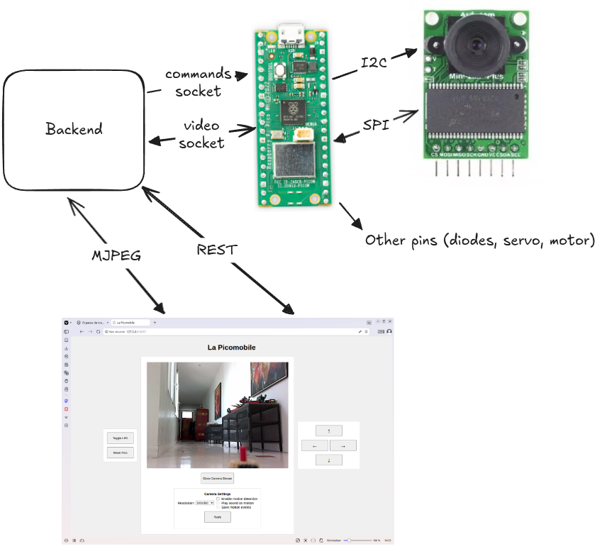
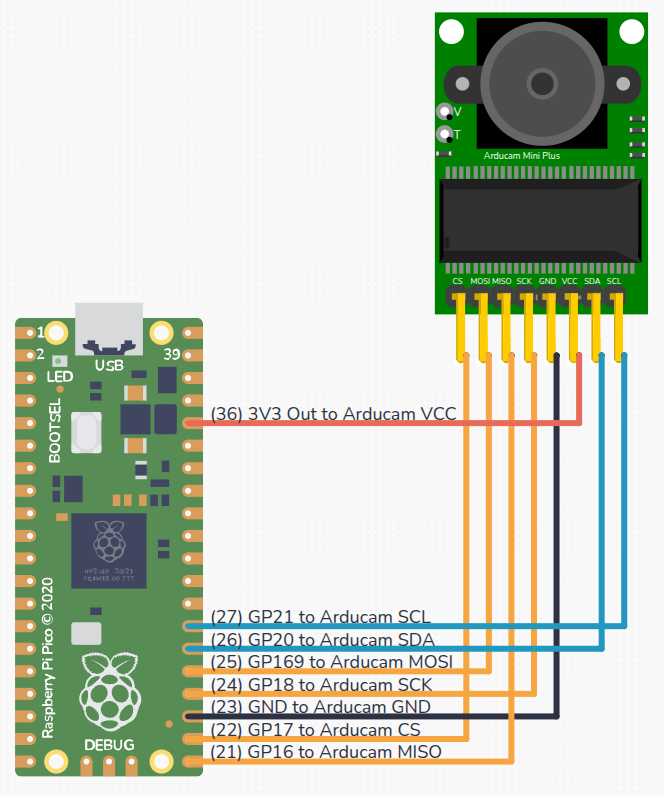

This repository contains the code which runs either

- the Picomobile as described in [https://dystroy.org/blog/picomobile](https://dystroy.org/blog/picomobile)
- the FPV Picomobile as described in [https://dystroy.org/blog/picamobile](https://dystroy.org/blog/picamobile)

# Material

- Raspberry Pico WH
- breadboard
- cable USB data de Raspberry
- resistor 220 Ohm
- diode
- jumper cables and capacitors
- Mini module Camera Arducam Shield OV2640 2MP Plus
- buck converter
- Schottky diode

# Hardware Setup

- Pico WH mounted on the Kitronik 5331
- resistance and diode (longer arm first) connected from Kitronik's GP27 to its GND
- Pico <-> Kitronik: GP2, GP3, GP6, GP7, GND
- Buck converter module receiving power from Lego batteries and powering the Pico (only) in 5V

## Arducam <-> Pico wiring

	Arducam (left to right) | Pico            | Purpose
	------------------------|-----------------|----------------------
	CS                      | GP17 (SPIO CSn) | SPI chip select
	MOSI                    | GP19 (SPIO TX)  | SPI Data - master output slave input
	MISO                    | GP16 (SPIO RX)  | SPI Data - master input slave output
	SCK  (SCLK)             | GP18 (SPIO SCK) | SPI clock
	GND                     | GND             | power ground
	VCC                     | 3V3 out         | powers the Arducam
	SDA                     | GP20 (I2C0 SDA) | configuration
	SCL                     | GP21 (I2C0 SCL) | I2C clock

				 +--USB--+
				 |       |
				 |       |
				 |       | (36) 3V3 Out         <---- [ Arducam VCC ]
				 |       |
				 |       |
				 |       |
				 |       | (28) GND
				 |       | (27) GP21 [I2C0 SCL] <---- [ Arducam SCL ]
				 | Pico  | (26) GP20 [I2C0 SDA] <---- [ Arducam SDA ]
				 |       | (25) GP19 [SPI0 TX]  <---- [ Arducam MOSI ]
				 |       | (24) GP18 [SPI0 SCK] <---- [ Arducam SCLK ]
				 |       | (23) GND
				 |       | (22) GP17 [SPI0 CSn] <---- [ Arducam CS ]
				 |       | (21) GP16 [SPI0 RX]  <---- [ Arducam MISO ]
				 +-------+

# Software setup

- cargo+rustup
- `brew install picotool`
- `brew install tio`
- `cargo install flip-link`

Embassy project in ../../embassy, on commit 46288501e (unfortunately, I couldn't use the version released on crates.io)

WIFI_SSID and WIFI_PASSWORD env vars must be set for compilation, for example in env.sh

# Connect the Pico for first installation or reinstallation

With USB cable connecting Mac to Pico:

1. Push (and keep pressed) the BootSel button on the Pico
2. Push and release the push button
3. Release the BootSel button

The Pico should be mounted as RPI-RP2 on the mac and be ready to receive the program.

# Instructions

`cargo run` should build and install (and thus launch) the program

To see the log, run `tio -l` to see the name of the flow, then `tio <name>`

On launching, the Pico registers and dumps its IP:

    waiting for DHCP...
    IPv4: UP
       IP address:      Cidr { address: 192.168.1.24, prefix_len: 24 }
       Default gateway: Some(192.168.1.1)
    Stack is up!
    Listening on TCP:1234...

Connect with `nc`, eg `nc 192.168.1.24 1234` and send commands finished by enter

Commands:
* blink n times, eg `b 5`
* run the Lego motor n milliseconds, eg `g 150` or `g -2000`
* toggle the led: `led`
* reset the Pico (for another install) with `q`

To kill tio, do `ctrl-T Q`.

It's possible to disconnect the USB cable and put the Lego power pack to ON.
After a few seconds for the WIFI to connect (there's no log as it goes through USB), you can command the Pico with `nc` and make it blink.

# Reset the Pico for new installation

Using `nc` send the command `q` (or `quit`).

After handling this command the Pico should be mounted as RPI-RP2 on the mac and be ready to receive the program.

# picomobile-gui

The picomobile-gui program launches a serve which allows web-based control of the Pico:
- driving the car with the keyboard's arrow keys
- doing a reset (same than using netcat to send `q`)
- viewing the camera image flow
